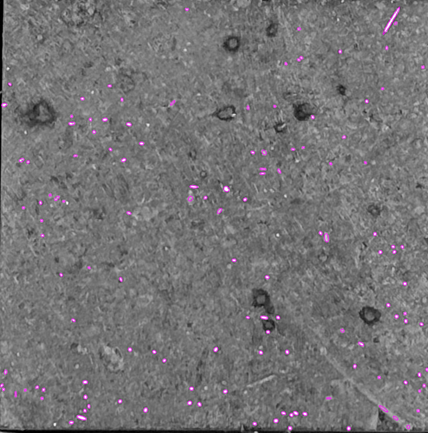
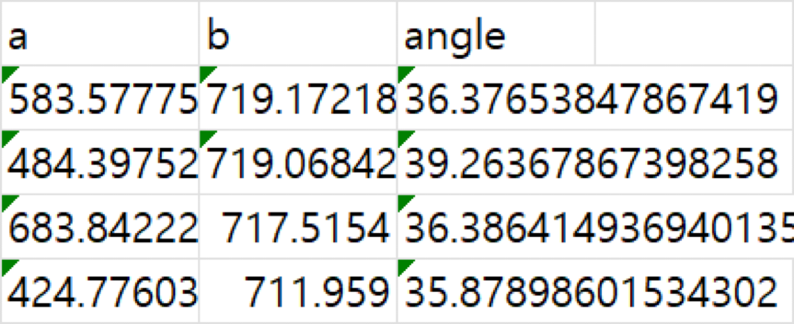

# Fiber detection in concrete using CV2



## How to use

move the target image into /Images </br>
edit the code in cv2.imread("Images/...) to file_name.file_extension

```commandline
pip install -r requirements.txt
python main.py
```

check the popup for resulting ellipses on image </br>
the result will be saved as result.csv

## Tuning the threshold
to get better results you might have to edit the threshold
there is two threshold on the code
1. `COLOR_THERSHOLD` : Threshold for color limit if it's lower the darker spots will be detected as fiber
2. `NOISE_THRESHOLD` : Threshold for noise limit the fiber area must be bigger to be detected

## Notice
1. The background color of the concrete image must be black(or very dark)
2. result.csv file will be overridden in every execution
3. result.csv will be formated as a(minor or major) b(minor or major) angle(the angle of the fiber orientation)
4. The fiber orientation angle is calculated by the following equation
$arccos(\frac{minor\_\ of\_\ ellipse}{major\_\ of\_\ ellipse})$ in degree


